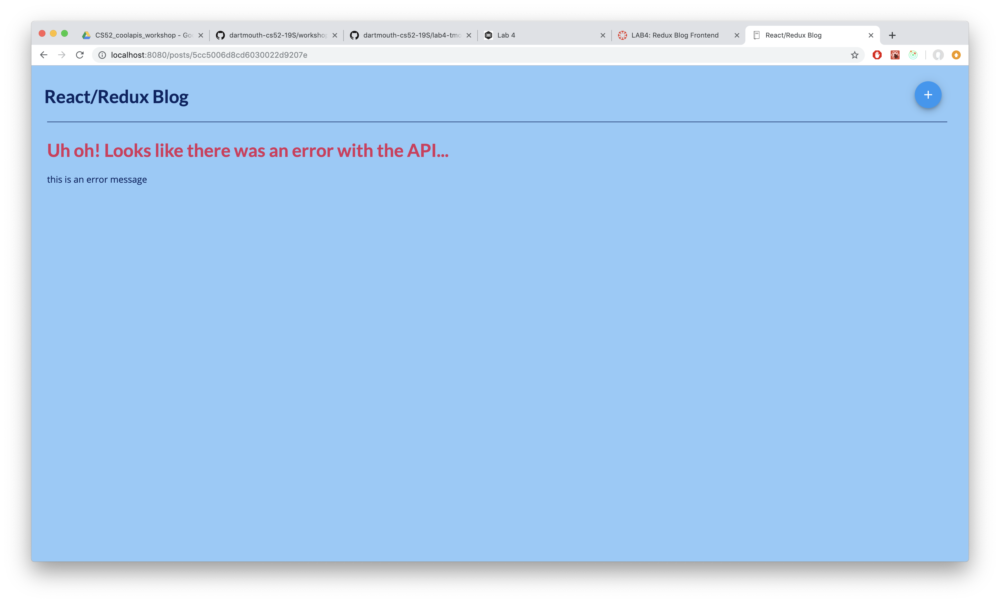
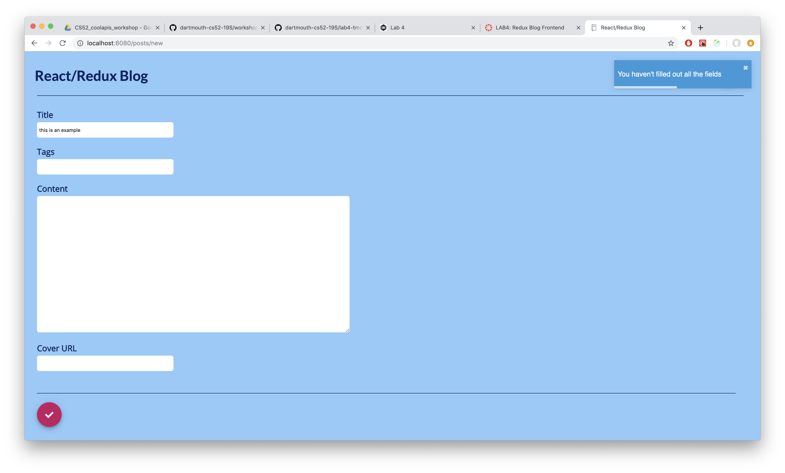

# Thomas Monfre CS52 Lab 4 :clipboard:

## What I Did
For this assignment, I built a live blog that is hosted at [tmonfre-blog.surge.sh](https://tmonfre-blog.surge.sh). Users can create blog posts, edit them, and delete them. Persistent storage and upate of posts is handled through the provided API. The blog posts have markdown support for text/visual content.

## What Worked / Didn't Work
I started by setting the routes necessary for the app. I then focused on allowing a user to create a post as a React component and view it. Since the `PostPreview` component isn't connected, I could do this all with basic React. Once a user could create a post in local state, I setup the redux infrastructure and added an action for creating a post. Once I had this working, I then built redux actions for fetching all posts from the database. With this in place, I then added several posts to the database. I then added functionality in redux for fetching a specific post. This gave me the base architecture of the app.

Once I had this, I then built out the rest of the app feature-by-feature. I focused first on updating post content. I created actions for this then ensured that the navigation properly moved after a user saved changes. I then focused on deleting a post.

I had some problems with handling navigation by pushing to history. I didn't initially realize that I could do that in my actions after the axios promise resolved. I also had some problems initially with the list view not updating unless I refreshed the page. This turned out to be a problem with `mapStateToProps`, which I was able to fix.

## Extra Credit

### Handling Axios Errors
I added an action `API_ERROR` for handling errors from `axios`. This basically will display the error message to the user when viewing a post if there is a failure. See below for an example:

### Input Validation
A user can't create a post unless all the fields are filled in. A warning appears if this happens. See below for an example:

---

# Lab 5 Changes :clipboard:

## What I Did
To modify the front-end for the changes coming from lab 5, I added login and sign-up routes, and changed the navbar to reflect this. I also added an `auth-reducer` to handle all redux actions regarding authentication. I also modified the way comments are displayed and handled. You can view the site live at [tmonfre-blog.surge.sh](https://tmonfre-blog.surge.sh).

## What Worked / Didn't Work
After implementing the necessary routes, models, and controllers on the backend, I began by developing a system for users to login/sign up. Once I had this in place, I then began adding features/customizations with this authentication.

I added the username of the person who authored each blog post to the preview and display of the post. Only the person who created each post can edit or delete it. I also added the ability to see who authored each comment. Only the creator of a comment can delete it.

I had some troubles with getting the comments to delete. It turns out it was a problem with my controller on the backend.

## Extra Credit

### Handling Auth Errors
I added an action for handling auth errors on the frontend. Users can see the error that is received when they request an invalid action.

## Permissions
Users can only edit/delete the posts they've created. Users can only delete comments they've created, regardless of the owner of the post. If you're not signed in, you can't leave a comment.